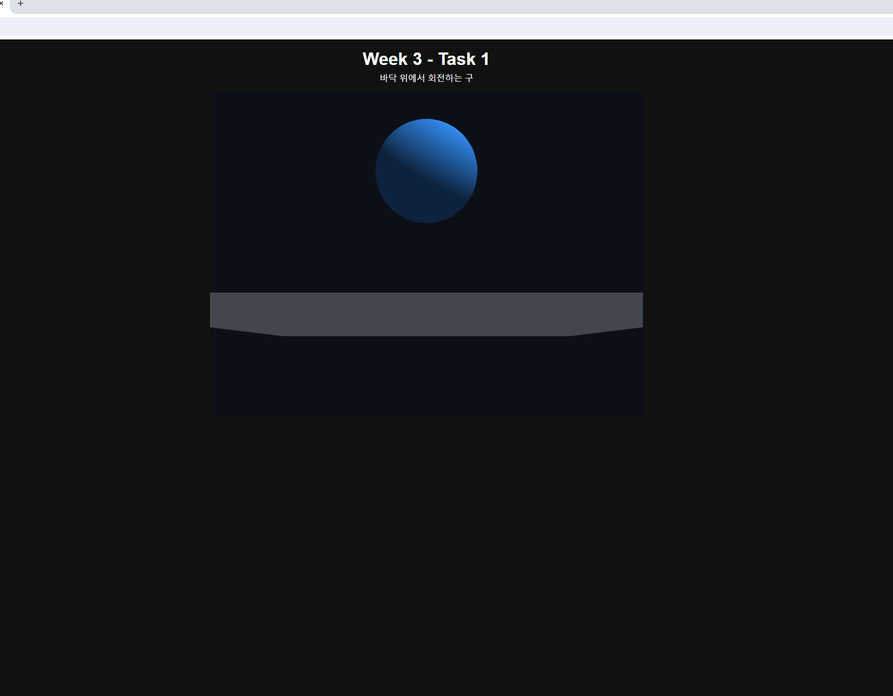
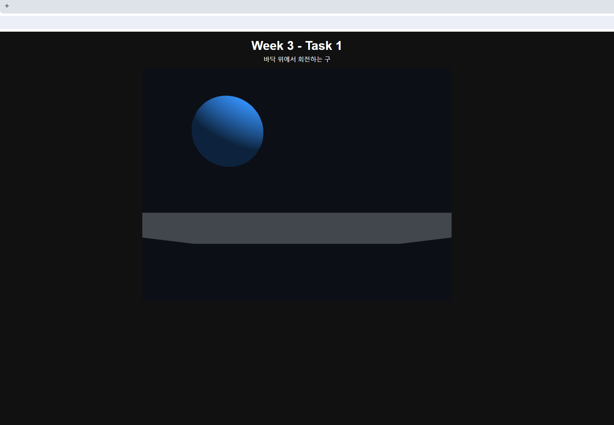
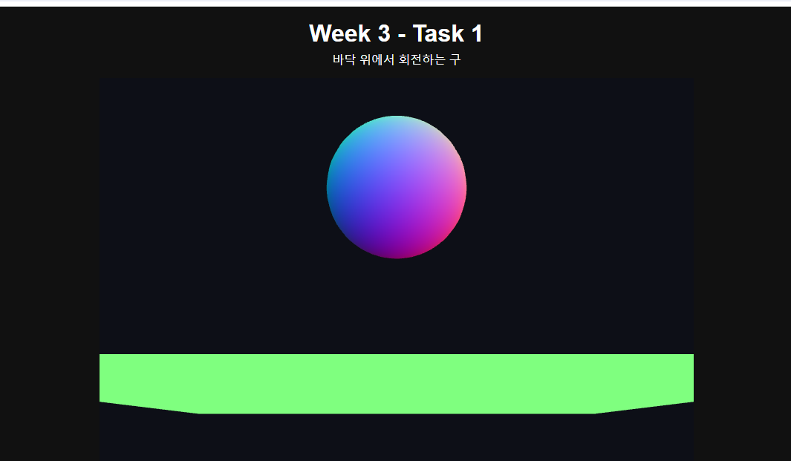
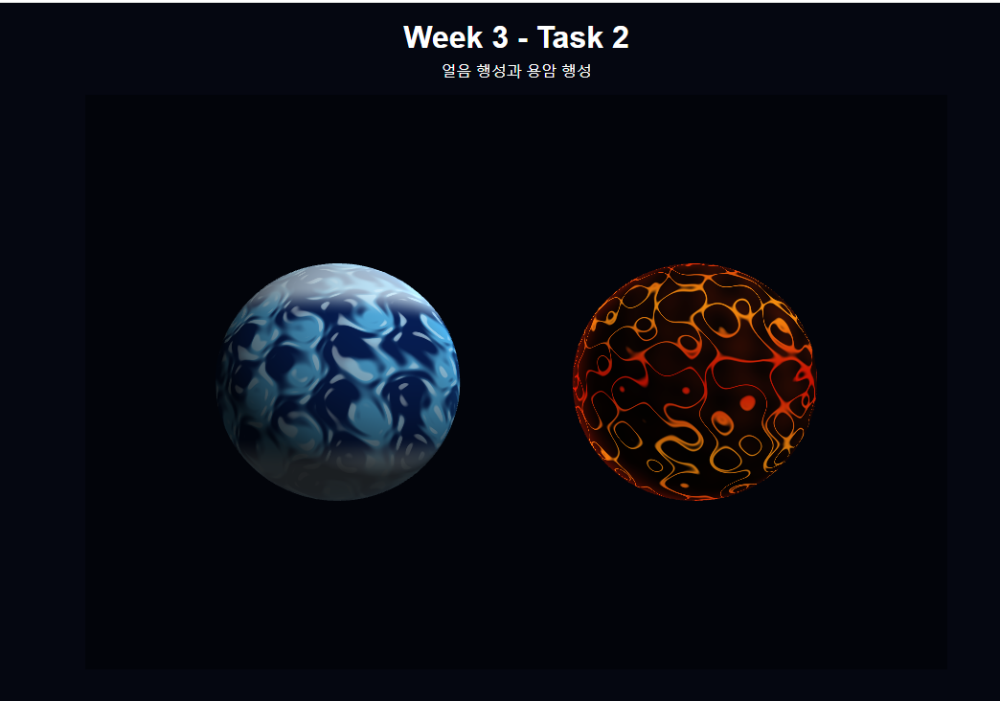

# Week 3 - WebGL 3D Graphics

Week 3에서는 WebGL2를 이용하여 3D 구와 행성을 구현하고,
행렬 변환, Depth Test, Shader, 조명 및 절차적 텍스처를 실험하였다.

---

## Task 1 - 회전하는 구

Task 1에서는 WebGL2를 이용하여 바닥 위에 떠 있는 3D 구를 만들고
Y축을 중심으로 회전하도록 구현하였다.

구는 직접 생성한 vertex와 normal 데이터를 이용하여 만들었으며,
Perspective Projection과 View Matrix를 적용하여 3차원 공간으로 표현하였다.

또한 법선 벡터와 빛의 방향을 이용하여 diffuse lighting을 적용하였다.

### 기본 실행 결과

---

### Matrix 순서 실험

이동 행렬과 회전 행렬의 곱셈 순서를 변경하여
구의 움직임이 어떻게 달라지는지 확인하였다.

수정 전에는 구가 현재 위치에서 제자리 회전을 하였다.

그러나 이동 행렬과 회전 행렬의 순서를 바꾼 후에는
구가 제자리에서 회전하지 않고 특정 중심을 기준으로
회전하는 모습을 확인할 수 있었다.

---

### Depth Test 실험

Depth Test를 활성화하여 3D 객체의 앞뒤 관계가
올바르게 표현되도록 하였다.

Depth Test를 비활성화하여 결과를 비교해 보았지만,
구가 바닥에서 비교적 높은 위치에 떠 있기 때문에
화면에서 뚜렷한 변화를 확인하기 어려웠다.

최종 버전에서는 다음과 같이 Depth Test를 활성화하였다.

    gl.enable(gl.DEPTH_TEST);
    gl.depthFunc(gl.LEQUAL);

---

### Shader 실험

Fragment Shader를 변경하여 구의 표면에
법선 벡터를 기반으로 한 색상을 표현해 보았다.

Shader를 변경한 후 구의 표면 색상이
무지개처럼 다양한 색으로 나타났으며,
전체적으로 빛나는 것처럼 보였다.

---

## Task 2 - Procedural Planets

Task 2에서는 이미지 텍스처를 사용하지 않고
Fragment Shader에서 직접 표면을 계산하여
두 개의 서로 다른 행성을 제작하였다.

제작한 행성은 다음과 같다.

- 빙하 행성 (Ice Planet)
- 용암 행성 (Lava Planet)

두 행성은 화면의 서로 다른 위치에 배치하였으며,
동시에 각각 자전하도록 구현하였다.

### 최종 실행 결과

---

## 제작 의도

빙하 행성과 용암 행성을 선택한 이유는
두 행성이 서로 대비되는 색상을 가지고 있어
시각적으로 더 뚜렷한 효과를 표현할 수 있다고 생각했기 때문이다.

또한 빙하와 용암은 개인적으로 관심이 있는
두 가지 주제이기도 하다.

제작하기 전에는 빙하 행성이 차갑고 단단한 느낌을 주도록
표현하고 싶었으며, 용암 행성은 뜨거운 느낌과 함께
표면에서 용암이 그라데이션처럼 흘러가는 모습을 표현하고 싶었다.

두 행성을 한 화면에 함께 배치함으로써
서로 다른 색상과 표면의 특징을 더욱 쉽게 비교하고,
두 행성의 차이가 시각적으로 더 뚜렷하게 보이도록 하였다.

---

## 제작 방법

두 행성의 표면은 이미지 텍스처를 사용하는 대신
Fragment Shader에서 직접 계산하여 표현하였다.

### 빙하 행성

빙하 행성은 여러 개의 `sin` 패턴을 조합하여
불규칙한 표면 무늬를 만들었다.

이후 `smoothstep`과 `mix` 함수를 사용하여
파란색, 밝은 파란색, 흰색 영역을 자연스럽게 혼합하였다.

이를 통해 얼음과 눈이 섞여 있는 것처럼
차갑고 단단한 표면을 표현하였다.

또한 위치 정보와 `uTime` 값을 이용하여
표면의 패턴에 변화를 주었다.

### 용암 행성

용암 행성은 여러 개의 변형된 `sin` 값을 이용하여
불규칙한 용암의 균열 패턴을 만들었다.

`abs`와 `smoothstep`을 사용하여 균열 영역을 구분하고,
어두운 암석 색상과 주황색 및 붉은색 계열의
밝은 용암 색상을 `mix`로 혼합하였다.

또한 `uTime`을 이용하여 용암의 밝기와 패턴에 변화를 주어
용암이 흐르는 듯한 효과를 표현하였다.

밝은 부분에는 추가적인 glow 효과를 적용하여
뜨겁게 빛나는 느낌을 강조하였다.

### Lighting

두 행성 모두 표면의 법선 벡터와 빛의 방향을 이용하여
diffuse lighting을 계산하였다.

이를 통해 구의 밝은 부분과 어두운 부분이 구분되어
평면적인 원이 아니라 입체적인 행성처럼 보이도록 하였다.

---

## 실행 결과 및 수정 과정

두 개의 행성은 화면에서 서로 다른 위치에 배치되어
동시에 자전하도록 구현하였다.

하나는 빙하 행성이고 다른 하나는 용암 행성으로 제작하였다.

각 행성의 이름과 특징에 어울리도록
텍스처와 색상을 표현하였으며,
두 행성이 서로 다른 분위기를 가지도록 하였다.

실행 과정에서는 특별한 오류를 발견하지 못했다.

처음 제작했을 때는 행성의 표현이 다소 단순하고
거칠게 보였기 때문에 이를 수정하였다.

텍스처와 시각적인 표현을 개선하여
현재의 모습으로 완성하였다.

---

## 실행 페이지

### Task 1

https://a1141114a.github.io/week2/week3/task1.html

### Task 2

https://a1141114a.github.io/week2/week3/task2.html
