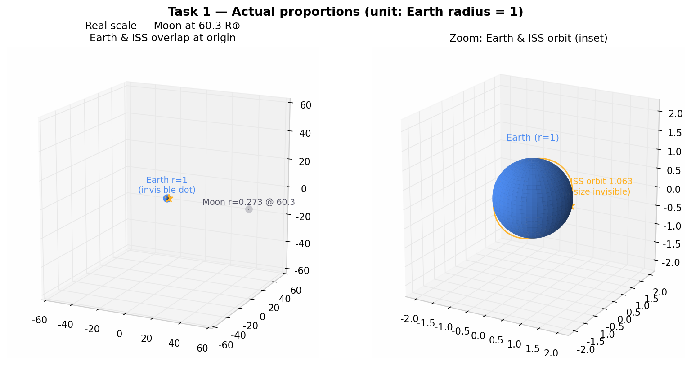
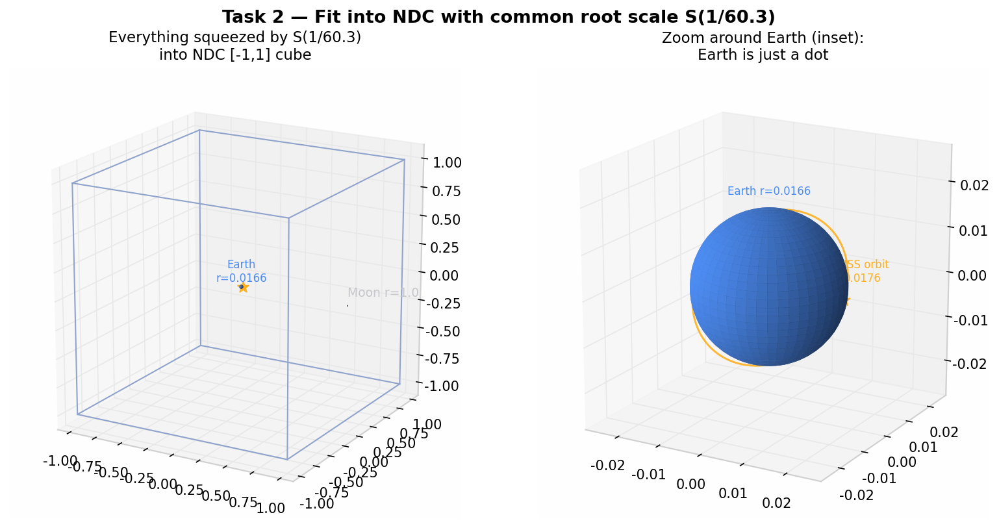
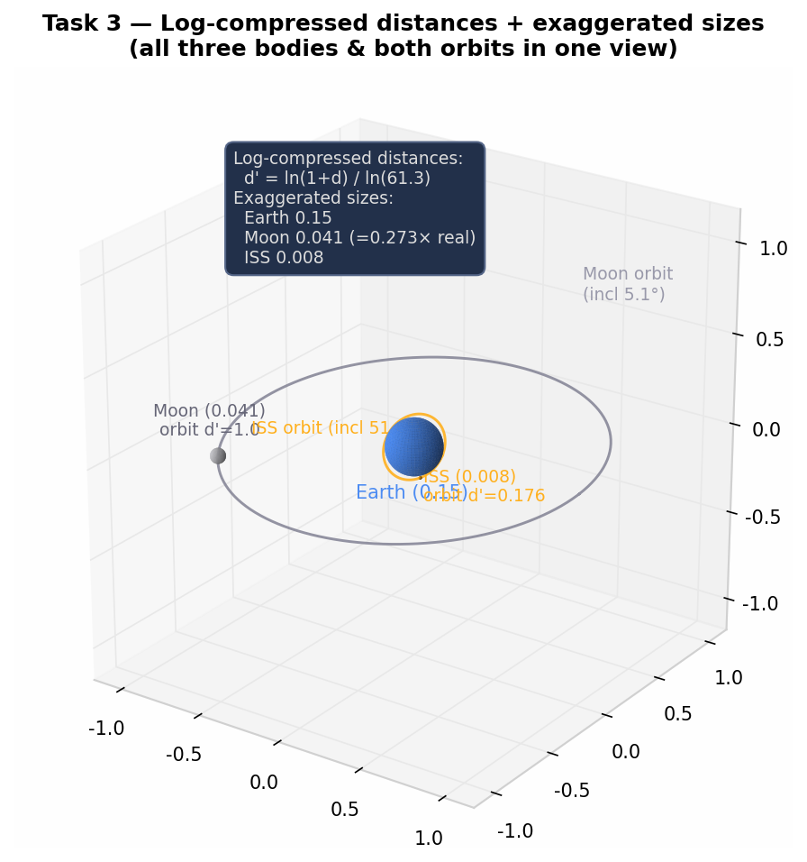

# Week 2 과제 1 — 지구 · 달 · 인공위성의 변환 설계

> 컴퓨터그래픽스 개인 프로젝트 2/8 · 변환과 행렬
> 실행 방법: `task1.html` ~ `task3.html` 을 Chrome 에서 그대로 열기 (더블클릭, 서버 불필요)

---

## 0. 자료 조사 — 대상 위성: 국제우주정거장 (ISS)

| 항목 | 실제 값 | 지구 반지름(=1) 기준 |
|---|---|---|
| 지구 반지름 | 6,371 km | 1 |
| 달 반지름 | 1,737 km | 0.273 |
| 지구–달 거리 | 384,400 km | **60.3** |
| ISS 궤도 고도 | 약 400 km | — |
| ISS 궤도 반지름 | 6,371 + 400 = **6,771 km** | **1.063** |
| ISS 크기 (가로) | 약 109 m | **0.0000171** |
| ISS 궤도 경사각 (inclination) | **51.6°** | — |
| ISS 공전 주기 | 약 92 분 | — |
| 달 궤도 경사각 | 약 5.1° | — |

조사 출처: NASA ISS 정보, satellitemap.space (위성 궤도 시각화 서비스).

> ⚠️ 애니메이션 가시성을 위해 각속도는 실제 공전 주기와 다르게 과장했다.
> (달: t*4 °/s, ISS: t*40 °/s, 지구 자전: t*30 °/s)
> 각속도 자체는 이번 과제(변환 설계)의 평가 대상이 아니므로 화면에서 움직임이 보이도록만 조정했다.

---

## Task 1 — 실제 비율로 만들기

### 1-1. 변환 입력값 전체

도구에 아래 단계를 **왼쪽 → 오른쪽** 순서로 입력한다. (`M1·M2·M3·p` 이므로 오른쪽이 먼저 적용된다.)

**지구** — 공전 없음, 원점에서 자전만:

| 단계 (왼쪽→오른쪽) | 의미 |
|---|---|
| `Rz(t*30)` | z축 자전 (공전 없이 원점에 있으므로 자전=세상 기준 자전) |
| `S(1)` | 크기 (지구 반지름 = 단위 1) |

**달** — 공전 + 조석 고정:

| 단계 (왼쪽→오른쪽) | 의미 |
|---|---|
| `Rx(5.1)` | 궤도면을 황도면에 대해 5.1° 기울임 |
| `Rz(t*4)` | 공전 (z축 중심, xy 평면) |
| `T(60.3,0,0)` | 지구 중심에서 60.3 만큼 떨어진 궤도 반지름 |
| `S(0.273)` | 실제 크기 비 (1,737 / 6,371) |

**ISS** — 공전 (고도 400 km):

| 단계 (왼쪽→오른쪽) | 의미 |
|---|---|
| `Rx(51.6)` | 궤도 경사 51.6° |
| `Rz(t*40)` | 공전 (92분 주기를 화면에서 보이게 과장) |
| `T(1.063,0,0)` | 궤도 반지름 = 지구 반지름 + 고도 |
| `S(0.0000171)` | 실제 크기 비 (109 m / 6,371 km) |

설정 JSON (도구에 그대로 입력):

```json
{
  "earth": ["Rz(t*30)", "S(1)"],
  "moon":  ["Rx(5.1)", "Rz(t*4)", "T(60.3,0,0)", "S(0.273)"],
  "iss":   ["Rx(51.6)", "Rz(t*40)", "T(1.063,0,0)", "S(0.0000171)"]
}
```

### 1-2. README 질문 답변

**Q1. 거리의 단위를 무엇으로 정했는가? 왜?**

> **지구 반지름 = 1** (즉 1 단위 = 6,371 km)으로 정했다.
> GPU 는 대개 32비트 실수(float32)로 계산하며 유효숫자가 약 7자리뿐이다.
> 거리를 **미터**로 두면 지구–달 거리 = 384,400,000 으로 유효숫자 7자리를 넘어서고,
> 이때 ISS 크기 109 m 는 반올림으로 통째로 소실된다.
> 반면 지구 반지름을 1로 두면 달 거리 60.3, ISS 궤도 1.063 처럼
> 작은 자릿수의 수로 다뤄져 **상대 비율의 정밀도를 최대한 지킬 수 있다.**

**Q2. 숫자가 커서 생긴 문제가 있었는가?**

> 있다. 지구 반지름 = 1 단위에서도 **ISS 크기 0.0000171** 는 지구(1)에 비해
> 10만 분의 1 수준이라 화면에서 점 하나로밖에 보이지 않는다.
> 만약 미터 단위를 썼다면 float32 유효숫자(7자리) 밖이라
> ISS 는 좌표 자체가 반올림되어 **아예 존재하지 않는 물체**가 된다.
> 즉 "단위를 잘 잡아도 크기 차이가 5자리 이상 나면 작은 물체는 살릴 수 없다"는
> 문제를 실제로 확인했다.

**Q3. 달·위성이 지구를 향하게 만든 것은 어느 변환 단계 덕분인가?**

> **가장 왼쪽의 공전 회전 `Rz` 단계** 덕분이다.
> 행렬 곱은 오른쪽부터 적용되므로, `Rz(공전)·…·T(거리)` 배치에서는
> `T` 로 밀어낸 물체까지 **공전 Rz 가 통째로** 돌린다.
> 물체의 로컬 −X 축이 항상 지구 중심(원점)을 향하게 되는 것이 곧 **조석 고정**이다.
> (화살표 = 로컬 +X 이므로 화살표가 늘 바깥을 가리키는지 확인했다.)
> 별도의 자전 단계를 오른쪽에 추가하면 오히려 세상 기준 2배 속도로 돌게 되어 깨진다 —
> 조석 고정은 "자전 단계를 넣는 것"이 아니라 **"공전 Rz 하나로 해결되는 것"**임을 확인했다.

### 1-3. 결과



- 실행: `task1.html` (ISS 구는 보이지 않아 주황 점으로만 표시 — 실제 비율의 한계 그 자체)
- 공유 링크: https://github.com/a1141114a/week2/blob/main/task1.html

---

## Task 2 — NDC 범위에 맞추기

### 2-1. 추가한 변환

WebGL 은 최종 좌표가 **−1 ≤ x, y, z ≤ 1** (NDC) 인 부분만 화면에 남긴다.
달의 거리가 60.3 이므로, **모든 물체에 공통으로** 루트 스케일을 추가한다:

```
S(1/60.3) = S(0.01658)   ← 각 물체의 변환 "맨 왼쪽"(= 세상 좌표계에 가장 나중에 적용)
```

| 물체 | 변환 (왼쪽→오른쪽) |
|---|---|
| 지구 | `S(0.01658)` · `Rz(t*30)` · `S(1)` |
| 달 | `S(0.01658)` · `Rx(5.1)` · `Rz(t*4)` · `T(60.3,0,0)` · `S(0.273)` |
| ISS | `S(0.01658)` · `Rx(51.6)` · `Rz(t*40)` · `T(1.063,0,0)` · `S(0.0000171)` |

**어디에 / 어떻게 넣었는가?**
물첼마다 따로 넣는 대신 **공통 루트 스케일**로 한 번에 처리했다 (세 물체의 상대 배치가 변하지 않도록).
적용 순서상 **가장 마지막(왼쪽)** 에 두어, 각 물체의 로컬 변환(공전·자전·조석 고정)이 모두 끝난 뒤
세상 전체를 통째로 1/60.3 배로 축소한다.

### 2-2. 변환 후 좌표

| | 변환 전 | 변환 후 (= NDC) |
|---|---|---|
| 달 궤도 반지름 | 60.3 | **1.000** (상자 끝에 정확히 닿음) |
| 지구 반지름 | 1 | 0.0166 |
| 달 반지름 | 0.273 | 0.0045 |
| ISS 궤도 반지름 | 1.063 | **0.0176** (지구 바로 옆) |
| ISS 크기 | 1.71e-5 | 2.8e-7 (사실상 소실) |

**실제 비율을 유지했는가?** 유지했다 — 모든 것이 같은 배수(1/60.3)로 줄었으므로
**상대 비율은 완벽히 그대로**다.

### 2-3. 결과 — 화면에서 보이는 것



- 실행: `task2.html` (흰색 와이어 상자 = NDC 정육면체)
- **지구는 지름 0.033의 작은 점**, 달은 상자 가장자리를 도는 점, ISS 는 지구에 겹친 점.
- "모두 NDC 안에 들어왔다"는 요구는 만족했지만, **정보 전달 관점에서는 실패** — 이것이 Task 3의 출발점이다.
- 공유 링크:https://github.com/a1141114a/week2/blob/main/task2.html

---

## Task 3 — 보는 사람을 위한 표현

### 3-1. 실제 비율이 정보 전달에 적합한가?

**부적절하다.** 이 장면에서 보여주고 싶은 정보는
① 세 물체의 위치 관계, ② 궤도의 형태와 경사, ③ 공전/자전/조석 고정이라는 **구조**이다.
그런데 실제 비율에서는 ISS 는 점, 달은 화면 밖, 지구도 구분 불가능한 점이라
세 가지 정보 **어느 것도 전달되지 않는다.** (지구–달 거리 60.3배, 크기 차이 10만 배는
한 화면의 동적 범위를 압도적으로 초과한다.)

### 3-2. 제안: 「거리는 로그 압축 + 크기만 과장」

**① 거리 로그 압축** — 거리 d 를 다음처럼 재매핑한다:

```
d' = ln(1 + d) / ln(1 + 60.3)
```

| 거리 d | d' | 근처에 보이는 것 |
|---|---|---|
| 60.3 (달) | **1.000** | 화면 가장자리 |
| 1.063 (ISS 궤도) | **0.176** | 지구 근처! |
| 1 (지구 표면) | 0.143 | — |

지구–달 거리는 유지(1.0)하면서, 지구에 "붙어 있던" ISS 궤도가
눈에 띄는 위치(0.176)로 올라온다.

**② 크기만 과장** — 거리 압축과 독립적으로 크기를 키운다:

| 물체 | 표시 크기 | 비고 |
|---|---|---|
| 지구 | **0.15** | 기준점 |
| 달 | **0.041** | = 지구 × 0.273, **지구-달 크기 비율은 실제 그대로** |
| ISS | **0.008** | 점 대신 작은 구로 관찰 가능 |

**③ 궤도 원 + 범례** — 달·ISS 궤도를 원으로 그리고 경사각을 표시해
"왜곡된 좌표"임을 명시한다 (교과서 태양계 그림과 같은 왜곡을 스스로 인지하도록).

최종 변환 입력값:

| 물체 | 변환 (왼쪽→오른쪽) |
|---|---|
| 지구 | `Rz(t*30)` · `S(0.15)` |
| 달 | `Rx(5.1)` · `Rz(t*4)` · `T(1.0,0,0)` · `S(0.041)` |
| ISS | `Rx(51.6)` · `Rz(t*40)` · `T(0.176,0,0)` · `S(0.008)` |

### 3-3. 장점과 잃는 것

| 장점 | 잃는 것 |
|---|---|
| 세 물체와 궤도 구조를 **한 화면**에 | 절대 크기·거리의 정확한 비율 |
| 공전·자전·조석 고정을 **눈으로 관찰** 가능 | "실제로는 얼마나 먼가"의 직관 |
| 지구–달 **크기 비율(0.273)** 만큼은 실제 값 | ISS 크기는 여전히 과장됨 |
| 궤도 경사(5.1° / 51.6°) 비교 가능 | 좌표 왜곡(로그) 자체를 설명해야 함 |

결론: **"무엇을 보여주려는가"에 따라 좋은 표현이 달라진다.**
실측 값의 정합성이 목적이면 Task 1, 파이프라인 검증이 목적이면 Task 2,
구조·울동의 이해가 목적이면 Task 3 이 적합하다.

### 3-4. 결과



- 실행: `task3.html` — 세 물체·두 궤도·조석 고정을 한 화면에서 확인 가능
- 공유 링크:https://github.com/a1141114a/week2/blob/main/task3.html

---

## 부록 — 파일 구성

```
week2/
├── week2.md       ← 이 보고서
├── task1.html     ← Task 1 실행 (실제 비율)
├── task2.html     ← Task 2 실행 (NDC 맞추기)
├── task3.html     ← Task 3 실행 (표현 개선)
└── images/
    ├── task1.png
    ├── task2.png
    └── task3.png
```
