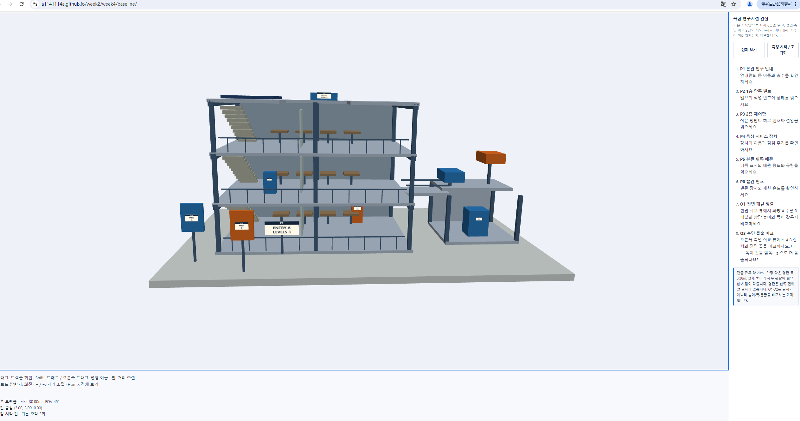
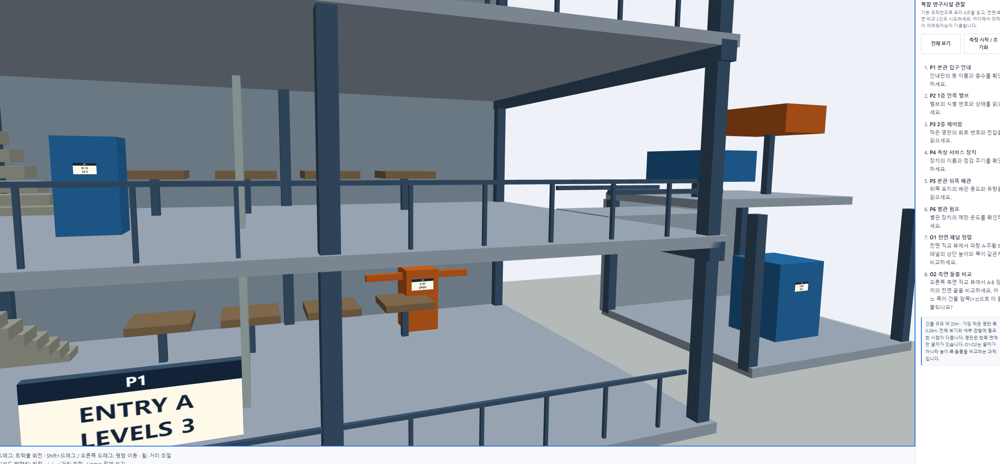
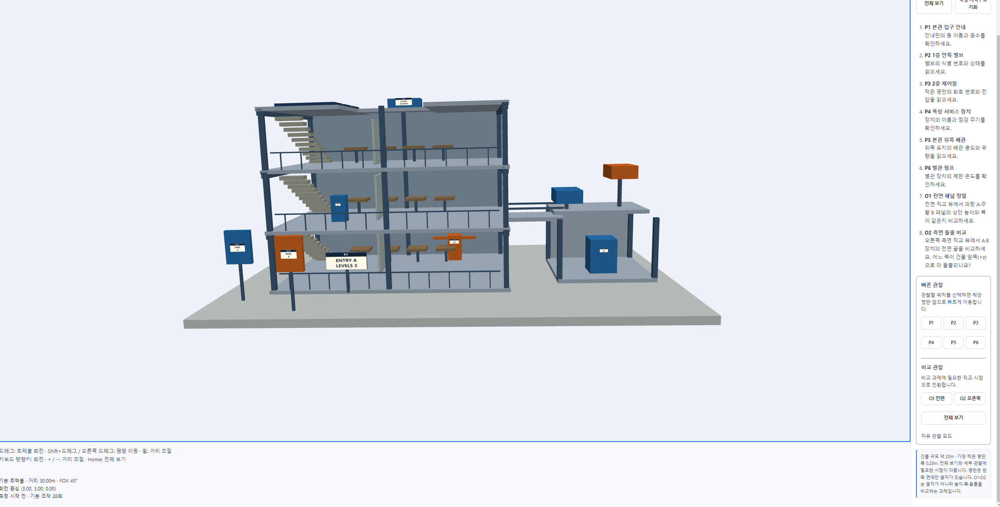
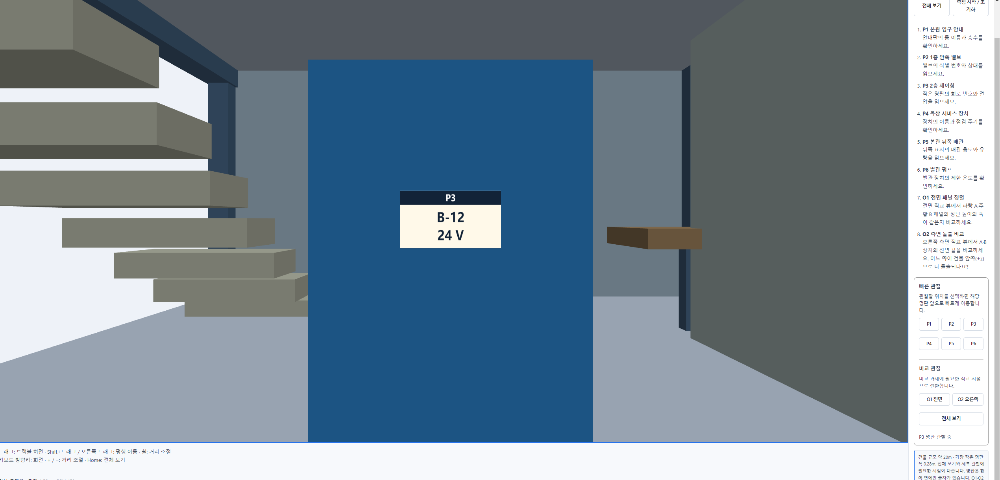
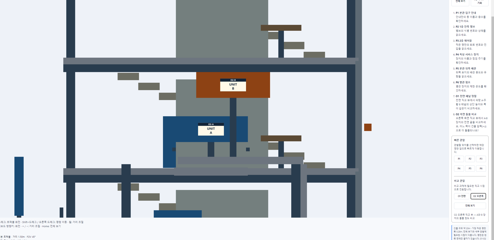

# Computer Graphics Week 04

## 복합 연구시설 관찰 인터페이스 개선

이번 과제에서는 기본으로 제공된 복합 연구시설 3D 뷰어를 직접 사용해 보고,
P1~P6의 정보 확인과 O1~O2의 비교 관찰 과정에서 발생하는 불편한 점을 확인하였다.

이후 기존 모델의 위치와 크기는 변경하지 않고,
관찰 과정을 더 편리하게 만들기 위한 인터페이스 기능을 추가하였다.

---

## 1. Baseline 관찰

먼저 제공된 기본 버전을 그대로 실행하여 전체 연구시설을 관찰하였다.

기본 버전에서는 마우스 드래그를 이용한 회전,
Shift + 드래그를 이용한 이동,
마우스 휠을 이용한 확대 및 축소 기능을 사용할 수 있었다.

하지만 P1~P6의 위치를 직접 찾는 과정에서는
원하는 위치를 찾기 위해 화면을 계속 회전시키고 확대해야 했다.

특히 건물 내부의 작은 글자를 확인하기 위해 화면을 확대하면
다른 구조물에 의해 글자가 가려지는 경우도 있었다.
따라서 정확한 위치와 정보를 확인하기 위해 여러 번 시점을 조절해야 했다.

---

## 2. 개선 아이디어

Baseline을 직접 사용하면서 확인한 가장 큰 문제는
특정 관찰 위치를 찾는 과정에 많은 조작이 필요하다는 것이었다.

따라서 다음과 같은 기능을 추가하기로 하였다.

- P1~P6 위치로 바로 이동할 수 있는 빠른 관찰 버튼
- 각 명판을 확인하기 적절한 거리와 방향으로 자동 이동
- O1 비교를 위한 전면 직교 뷰
- O2 비교를 위한 오른쪽 측면 직교 뷰
- 빠른 관찰 이후 다시 전체 화면으로 돌아갈 수 있는 기능

기존의 자유로운 Trackball 조작 기능은 그대로 유지하고,
필요할 때만 빠른 관찰 기능을 사용할 수 있도록 설계하였다.

---

## 3. Improved Interface

개선 버전에서는 기존 인터페이스에 `빠른 관찰` 영역을 추가하였다.

P1~P6 버튼과 O1, O2 비교 버튼을 한 곳에 배치하여
사용자가 원하는 관찰 위치를 쉽게 선택할 수 있도록 하였다.

---

## 4. P1~P6 빠른 관찰 기능

P1~P6 버튼을 클릭하면
각 명판의 위치와 적절한 관찰 시점으로 자동 이동하도록 구현하였다.

각 버튼에는 해당 명판의 위치에 맞는
카메라 중심, 거리, 방향을 설정하였다.

이를 통해 기존처럼 계속 화면을 회전하거나 확대하면서
목표 위치를 직접 찾을 필요가 없어졌다.

특히 P3의 경우 작은 명판이기 때문에
기본 인터페이스에서는 위치를 찾고 글자를 확인하기 위해
여러 번 시점을 조절해야 했다.

개선 버전에서는 P3 버튼을 클릭하는 것만으로
해당 명판 가까이 이동할 수 있어 정보를 더 편리하게 확인할 수 있었다.

---

## 5. O1 전면 직교 뷰

O1 과제에서는 파란색 A 패널과 주황색 B 패널을
전면에서 비교해야 한다.

기본 버전에서는 사용자가 직접 화면을 회전하면서
두 패널을 비교하기 적절한 시점을 만들어야 했다.

개선 버전에서는 `O1 전면` 버튼을 추가하여
버튼을 클릭하면 두 패널을 비교하기 위한
전면 직교 뷰로 바로 전환되도록 구현하였다.

직교 시점을 사용함으로써 화면의 시점과 비율이 일정하게 유지되어
두 패널의 높이와 폭을 더욱 편리하게 비교할 수 있었다.

---

## 6. O2 오른쪽 측면 직교 뷰

O2 과제에서는 두 장치의 돌출 정도를
오른쪽 측면에서 비교해야 한다.

이를 위해 `O2 오른쪽` 버튼을 추가하였다.

버튼을 클릭하면 미리 설정한 오른쪽 측면 직교 뷰로 전환되어
두 장치를 일정한 시점에서 관찰할 수 있도록 하였다.

기본 버전처럼 직접 회전하여 정확한 측면 시점을 맞출 필요가 없기 때문에
두 장치의 위치와 돌출 정도를 더욱 편리하게 비교할 수 있었다.

---

## 7. Baseline과 Improved 비교

### Baseline

- P1~P6의 위치를 사용자가 직접 찾아야 한다.
- 원하는 위치를 찾기 위해 반복적으로 화면을 회전하고 확대해야 한다.
- 작은 명판을 확대하면 주변 구조물에 가려지는 경우가 있다.
- O1과 O2의 비교 시점을 사용자가 직접 조절해야 한다.

### Improved

- P1~P6 버튼을 이용하여 원하는 위치로 바로 이동할 수 있다.
- 각 위치에 적합한 거리와 방향으로 자동 이동한다.
- 작은 명판도 빠르게 가까이에서 관찰할 수 있다.
- O1과 O2를 위한 직교 뷰를 버튼으로 바로 사용할 수 있다.
- 비교 화면의 시점과 비율이 일정하여 관찰이 더 편리하다.

---

## 8. 결과 및 느낀 점

이번 과제를 통해 3D 공간에서는 단순히 모델을 자유롭게 회전할 수 있는 것뿐만 아니라,
사용자가 원하는 정보를 얼마나 쉽고 빠르게 찾을 수 있는지도 중요하다는 것을 확인하였다.

기본 버전에서는 P1~P6의 위치를 찾기 위해
계속 회전과 확대를 반복해야 했지만,
빠른 관찰 버튼을 추가한 이후에는 한 번의 클릭으로
원하는 위치를 확인할 수 있어 훨씬 편리하였다.

또한 O1과 O2에 직교 뷰를 추가한 후에는
비교 대상의 시점과 화면 비율이 더욱 일정하고 정돈되어 보였으며,
두 대상을 비교하기도 더 쉬워졌다.

이번 개선을 통해 기존 Trackball 방식의 자유로운 관찰 기능은 유지하면서,
특정 정보를 빠르게 확인하고 비교할 수 있는 기능을 함께 제공할 수 있었다.
